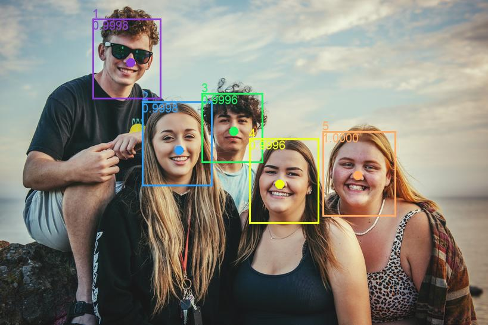

# frs-core
This is a component of Exadel Face Recognition Service. EFRS is a service for face recognition: upload images with faces of known people, then upload a new image, and the service will recognize faces in it.

- Public page about EFRS - [\[Confluence KC\] Exadel Face Recognition Service](https://confluence.exadel.com/display/KC/Exadel+Face+Recognition+Service)
- EFRS Documentation - [Confluence EFRS](https://confluence.exadel.com/display/EFRS/Exadel+FRS+Home)
- EFRS API Contract - [\[Confluence KC\] FRS REST API](https://confluence.exadel.com/display/KC/FRS+REST+API)
- frs-core Documentation - [\[Confluence EFRS\] Python Core Service](https://confluence.exadel.com/display/EFRS/Python+Core+Service)
- frs-core API Contract
    - Swagger UI on QA Environment - [apidocs](http://qa.frs.exadel.by:3000/apidocs), [apidocs2](http://qa.frs.exadel.by:3000/apidocs2)
    - Swagger UI run locally (app must be started) - [apidocs](http://localhost:3000/apidocs), [apidocs2](http://localhost:3000/apidocs2)

### Table of Contents

- [Test](#starting-the-service)

# Starting the service
### With Docker
1. Build the container: `$ make build`
2. Start it: `$ make up`
3. Stop it: `$ make down`

You can combine steps 1 and 2: `$ make build up`

### In development environment, container-less
1. Setup dependencies: `$ make setup`
2. Start main app in debug mode: `$ make start`
3. Stop it: `$ make stop`

# Testing the service
### With Docker
Builds containers, run tests inside: `$ make docker` 

### In development environment, container-less
1. Setup dependencies: `$ make setup`
2. Run all tests: `$ make local`
   - Unit tests: `$ make unit`
   - Integration tests:` $ make i9n`
   - End-to-end tests: `$ make e2e`
   - Lint check: `$ make lint`

### End-to-end tests against a remote host

Use `$ make e2e_remote`, for example:

`$ make e2e_remote ML_URL=http://example.com/api API_KEY=f74a-af5f DROP_DB=false`

# Miscellaneous
### Make arguments
Most targets support additional arguments. Let's use `$ make up` as an example:
- `$ make up ID=2` - Helps solve container name collisions (appends the ID at the end, so that container `ml` becomes `ml2`). Useful for building/running/testing different branches at the same time
- `$ make up PORT=8080 MONGODB_PORT=6650` - Sets the exposed port for the service and the database

### Additional make targets and arguments
Check `Makefile` for more make targets and arguments that are not mentioned in this README.

### Notes for Windows users
- Containers may not build/run because of CRLF file endings. To fix, run `$ dos2unix * ml/* e2e/*`.
- uWSGI does not support Windows, workaround is removing it from `ml/requirements.txt` before running `$ make setup` and adding it back afterwards.
