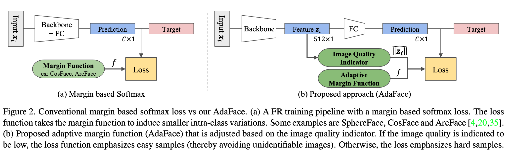
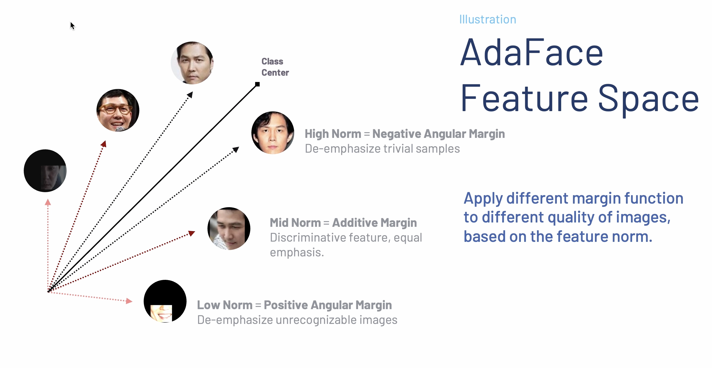

# AdaFace: Quality Adaptive Margin for Face Recognition

Official github repository for AdaFace: Quality Adaptive Margin for Face Recognition. 
The paper (https://arxiv.org/abs/2204.00964) is presented in CVPR 2022 (Oral). 


> Abstract: Recognition in low quality face datasets is challenging because facial attributes are obscured and degraded. Advances in margin-based loss functions have resulted in enhanced discriminability of faces in the embedding space. Further, previous studies have studied the effect of adaptive losses to assign more importance to misclassified (hard) examples. In this work, we introduce another aspect of adaptiveness in the loss function, namely the image quality. We argue that the strategy to emphasize misclassified samples should be adjusted according to their image quality. Specifically, the relative importance of easy and hard samples should be based on the sample's image quality. We propose a new loss function that emphasizes samples of different difficulty based on their image quality. Our method achieves this in the form of an adaptive margin function by approximating the image quality with feature norms. Extensive experiments show that our method, AdaFace, improves the face recognition performance over the state-of-the-art (SoTA) on four datasets (IJB-B, IJB-C, IJB-S and TinyFace).

```angular2html
@inproceedings{kim2022adaface,
  title={AdaFace: Quality Adaptive Margin for Face Recognition},
  author={Kim, Minchul and Jain, Anil K and Liu, Xiaoming},
  booktitle={Proceedings of the IEEE/CVF Conference on Computer Vision and Pattern Recognition},
  year={2022}
}
```



[](https://paperswithcode.com/sota/face-verification-on-ijb-b?p=adaface-quality-adaptive-margin-for-face)
[](https://paperswithcode.com/sota/face-recognition-closed-set-on-tinyface?p=adaface-quality-adaptive-margin-for-face)
[](https://paperswithcode.com/sota/surveillance-to-booking-on-ijb-s?p=adaface-quality-adaptive-margin-for-face)
[](https://paperswithcode.com/sota/surveillance-to-single-on-ijb-s?p=adaface-quality-adaptive-margin-for-face)
[](https://paperswithcode.com/sota/surveillance-to-surveillance-on-ijb-s?p=adaface-quality-adaptive-margin-for-face)

### Repository Updates
- [x] Pytorch Lightning 1.8 compatibility is tested. 
- [x] 5 Minute video presentation uploaded.
- [x] Added the option to directly train with InsightFace dataset (train.rec) files without extracting images.

### News
- You can also check out our new paper `Cluster and Aggregate (CAFace, NeurIPS2022)` [Link](https://paperswithcode.com/paper/cluster-and-aggregate-face-recognition-with) for video based face recognition. TLDR: Face recognition with long probe videos.

### 5 Minute Video Presentation
[](https://www.youtube.com/watch?v=NfHzn6epAHM "AdaFace 5 minute video presentation")

- https://www.youtube.com/watch?v=NfHzn6epAHM
- The talk was given during the CVPR 2022 Conference. 
Thank you all who showed interest in the paper during the oral and poster session. 


### Demo Comparison between AdaFace and ArcFace on Low Quality Images


The demo shows a comparison between AdaFace and ArcFace on a live video.
To show how model performs with low quality images, we show `original`, `blur+` and `blur++` setting where
`blur++` means it is heavily blurred. 
The numbers with colorbox show the cosine similarity between the live image and the cloest matching gallery image.
The statistics on the bottom show the cumulative count of true positive match for `blur++` setting. 
AdaFace has high true positive rate. 
It also shows it is less prone to making false positive (red) mistakes as sometimes observed in ArcFace.

# Usage

```python
import torch
from head import AdaFace

# typical inputs with 512 dimension
B = 5
embbedings = torch.randn((B, 512)).float()  # latent code
norms = torch.norm(embbedings, 2, -1, keepdim=True)
normalized_embedding  = embbedings / norms
labels =  torch.randint(70722, (B,))

# instantiate AdaFace
adaface = AdaFace(embedding_size=512,
                  classnum=70722,
                  m=0.4,
                  h=0.333,
                  s=64.,
                  t_alpha=0.01,)

# calculate loss
cosine_with_margin = adaface(normalized_embedding, norms, labels)
loss = torch.nn.CrossEntropyLoss()(cosine_with_margin, labels)
```


# Installation

```
conda create --name adaface pytorch==1.8.0 torchvision==0.9.0 cudatoolkit=10.2 -c pytorch
conda activate adaface
conda install scikit-image matplotlib pandas scikit-learn 
pip install -r requirements.txt
```

# Train (Preapring Dataset and Training Scripts)
- Please refer to [README_TRAIN.md](./README_TRAIN.md)
- [IMPORTANT] Note that our implementation assumes that input to the model is `BGR` color channel as in `cv2` package. InsightFace models assume `RGB` color channel as in `PIL` package. So all our evaluation code uses `BGR` color channel with `cv2` package.

# Pretrained Models
Note that our pretrained model takes the input in BGR color channel. 
This is different from the InsightFace released model which uses RGB color channel. 

| Arch | Dataset    | Link                                                                                         |
|------|------------|----------------------------------------------------------------------------------------------|
| R18  | CASIA-WebFace     | [gdrive](https://drive.google.com/file/d/1BURBDplf2bXpmwOL1WVzqtaVmQl9NpPe/view?usp=sharing) |
| R18  | VGGFace2     | [gdrive](https://drive.google.com/file/d/1k7onoJusC0xjqfjB-hNNaxz9u6eEzFdv/view?usp=sharing) |
| R18  | WebFace4M     | [gdrive](https://drive.google.com/file/d/1J17_QW1Oq00EhSWObISnhWEYr2NNrg2y/view?usp=sharing) |
| R50  | CASIA-WebFace     | [gdrive](https://drive.google.com/file/d/1g1qdg7_HSzkue7_VrW64fnWuHl0YL2C2/view?usp=sharing) |
| R50  | WebFace4M     | [gdrive](https://drive.google.com/file/d/1BmDRrhPsHSbXcWZoYFPJg2KJn1sd3QpN/view?usp=sharing) |
| R50  | MS1MV2     | [gdrive](https://drive.google.com/file/d/1eUaSHG4pGlIZK7hBkqjyp2fc2epKoBvI/view?usp=sharing) |
| R100 | MS1MV2     | [gdrive](https://drive.google.com/file/d/1m757p4-tUU5xlSHLaO04sqnhvqankimN/view?usp=sharing) |
| R100 | MS1MV3     | [gdrive](https://drive.google.com/file/d/1hRI8YhlfTx2YMzyDwsqLTOxbyFVOqpSI/view?usp=sharing) |
| R100 | WebFace4M  | [gdrive](https://drive.google.com/file/d/18jQkqB0avFqWa0Pas52g54xNshUOQJpQ/view?usp=sharing) |
| R100 | WebFace12M | [gdrive](https://drive.google.com/file/d/1dswnavflETcnAuplZj1IOKKP0eM8ITgT/view?usp=sharing) |


# Inferece

### Example using provided sample images
AdaFace takes input images that are preproccsed. 
The preprocessing step involves 
1. aligned with facial landmark (using MTCNN) and 
2. cropped to 112x112x3 size whose color channel is BGR order. 

We provide the code for performing the preprocessing step. 
For using pretrained AdaFace model for inference, 

1. Download the pretrained adaface model and place it in `pretrained/`

2. For using pretrained AdaFace on below 3 images, run 
```
python inference.py
```

|                              img1                              |                              img2                              |                                                           img3 |
|:--------------------------------------------------------------:|:--------------------------------------------------------------:|---------------------------------------------------------------:|
|  |  |  |

The similarity score result should be 
```
tensor([[ 1.0000,  0.7334, -0.0655],
        [ 0.7334,  1.0000, -0.0277],
        [-0.0655, -0.0277,  1.0000]], grad_fn=<MmBackward0>)
```

### General Inference Guideline
In a nutshell, inference code looks as below.
```python
from face_alignment import align
from inference import load_pretrained_model, to_input

model = load_pretrained_model('ir_50')
path = 'path_to_the_image'
aligned_rgb_img = align.get_aligned_face(path)
bgr_input = to_input(aligned_rgb_img)
feature, _ = model(bgr_input)
```

- Note that AdaFace model is a vanilla pytorch model which takes in `bgr_input` which is 112x112x3 
torch tensor with BGR color channel whose value is normalized with `mean=0.5` and `std=0.5`, 
as in [to_input()](https://github.com/mk-minchul/AdaFace/blob/d8114b3ca8c54cd81ef59ac34c19eda1c548ca17/inference.py#L22)
- When preprocessing step produces error, it is likely that the MTCNN cannot find face in an image. 
Refer to [issues/28](https://github.com/mk-minchul/AdaFace/issues/28) for the discussion.
# Validation

## High Quality Image Validation Sets (LFW, CFPFP, CPLFW, CALFW, AGEDB)
For evaluation on 5 HQ image validation sets with pretrained models,
refer to 
```
bash validation_hq/eval_5valsets.sh
```

| Arch | Dataset        | Method   | LFW    | CFPFP  | CPLFW   | CALFW   | AGEDB  | AVG       |
|------|----------------|----------|--------|--------|---------|---------|--------|-----------|
| R18  | CASIA-WebFace	 | AdaFace  | 0.9913 | 0.9259 | 0.8700  | 0.9265  | 0.9272 | 0.9282    |
| R18  | VGGFace2       | AdaFace  | 0.9947 | 0.9713 | 0.9172  | 0.9390  | 0.9407 | 0.9526    |
| R18  | WebFace4M      | AdaFace  | 0.9953 | 0.9726 | 0.9228  | 0.9552  | 0.9647 | 0.9621    |
| R50  | CASIA-WebFace	 | AdaFace  | 0.9942 | 0.9641 | 0.8997  | 0.9323  | 0.9438 | 0.9468    |
| R50  | MS1MV2         | AdaFace  | 0.9982 | 0.9786 | 0.9283  | 0.9607  | 0.9785 | 0.9688    |
| R50  | WebFace4M      | AdaFace  | 0.9978 | 0.9897 | 0.9417  | 0.9598  | 0.9778 | 0.9734    |
| R100 | MS1MV2         | AdaFace  | 0.9982 | 0.9849 | 0.9353  | 0.9608  | 0.9805 | 0.9719    |
| R100 | MS1MV3         | AdaFace  | 0.9978 | 0.9891 | 0.9393  | 0.9602  | 0.9817 | 0.9736    |
| R100 | WebFace4M      | AdaFace  | 0.9980 | 0.9917 | 0.9463  | 0.9605  | 0.9790 | 0.9751    |
| R100 | WebFace12M     | AdaFace  | 0.9982 | 0.9926 | 0.9457  | 0.9612  | 0.9800 | 0.9755    |


#### Comparison with Other Methods

| Arch | Dataset       | Method    | LFW    | CFPFP  | CPLFW  | CALFW  | AGEDB  | AVG    |
|------|---------------|-----------|--------|--------|--------|--------|--------|--------|
| R50  | CASIA-WebFace	 | AdaFace  | 0.9942 | 0.9641 | 0.8997  | 0.9323  | 0.9438 | 0.9468    |
| R50  | CASIA-WebFace | (ArcFace) | 0.9945 | 0.9521 | NA      | NA     | 0.9490 | NA        |
| R100 | MS1MV2         | AdaFace  | 0.9982 | 0.9849 | 0.9353  | 0.9608  | 0.9805 | 0.9719    |
| R100 | MS1MV2        | (ArcFace) | 0.9982 | NA     | 0.9208 | 0.9545 | NA     | NA     |


## Mixed Quality Scenario (IJBB, IJBC Dataset)

For IJBB, IJBC validation, refer to 
```
cd validation_mixed
bash eval_ijb.sh
```

| Arch | Dataset    | Method      | IJBB TAR@FAR=0.01% | IJBC TAR@FAR=0.01% |
|------|------------|-------------|--------------------|--------------------|
| R18  | VGG2       | AdaFace | 90.67              | 92.95              |
| R18  | WebFace4M  | AdaFace | 93.03              | 94.99              |
| R50  | WebFace4M  | AdaFace | 95.44              | 96.98              |
| R50  | MS1MV2     | AdaFace | 94.82              | 96.27              |
| R100 | MS1MV2     | AdaFace | 95.67              | 96.89              |
| R100 | MS1MV3     | AdaFace | 95.84              | 97.09              |
| R100 | WebFace4M  | AdaFace      | 96.03              | 97.39              |
| R100 | WebFace12M | AdaFace      | 96.41              | 97.66              |

#### Comparison with Other Methods
- Numbers for other methods come from their respective papers.

| Arch | Dataset       | Method           | Venue  | IJBB TAR@FAR=0.01% | IJBC TAR@FAR=0.01% |
|------|---------------|------------------|--------|--------------------|--------------------|
| R100 | MS1MV2        | **AdaFace**          | CVPR22 | **95.67**          | **96.89**          |
| R100 | MS1MV2        | (MagFace)        | CVPR21 | 94.51              | 95.97              |
| R100 | MS1MV2        | (SCF-ArcFace)    | CVPR21 | 94.74              | 96.09              |
| R100 | MS1MV2        | (BroadFace)      | ECCV20 | 94.97              | 96.38              |
| R100 | MS1MV2        | (CurricularFace) | CVPR20 | 94.80              | 96.10              |
| R100 | MS1MV2        | (MV-Softmax)     | AAAI20 | 93.60              | 95.20              |
| R100 | MS1MV2        | (AFRN)           | ICCV19 | 88.50              | 93.00              |
| R100 |        MS1MV2 | (ArcFace)        | CVPR19 | 94.25              | 96.03              |
| R100 |        MS1MV2 |        (CosFace) | CVPR18 | 94.80              | 96.37              |

| Arch | Dataset    | Method           |  IJBC TAR@FAR=0.01% |
|------|------------|------------------|---------------------|
| R100 | WebFace4M  | **AdaFace**      |  **97.39**              |
| R100 | WebFace4M  | (CosFace)        |  96.86              |
| R100 | WebFace4M  | (ArcFace)        |  96.77              |
| R100 | WebFace4M  | (CurricularFace) |  97.02              |

| Arch | Dataset    | Method           |  IJBC TAR@FAR=0.01% |
|------|------------|------------------|---------------------|
| R100 | WebFace12M | **AdaFace**      |  **97.66**              |
| R100 | WebFace12M | (CosFace)        |  97.41              |
| R100 | WebFace12M | (ArcFace)        |  97.47              |
| R100 | WebFace12M | (CurricularFace) |  97.51              |

# Low Quality Scenario (IJBS)

For IJBB, IJBC validation, refer to
```
cd validation_lq
python validate_IJB_S.py
```

#### Comparison with Other Methods


|      |                  |            |  Sur-to-Single            |        |       | Sur-to-Book |        |       | Sur-to-Sur |           |          | TinyFace  |           |
|------|------------------|------------|--------------|--------|-------|-------------|--------|-------|------------|-----------|----------|-----------|-----------|
| Arch | Method           | Dataset    | Rank1       | Rank5 | 1%    | Rank1       | Rank5 | 1%    | Rank1      | Rank5     | 1%       | rank1     | rank5     |
| R100 | **AdaFace**      | WebFace12M |        **71.35** | **76.24**  | **59.39** | **71.93**   | **76.56**  | **59.37** | **36.71**  | **50.03** | **4.62** | **72.29** | **74.97** |
| R100 | **AdaFace**      | WebFace4M  |        **70.42** | **75.29**  | **58.27** | **70.93**   | **76.11**  | **58.02** | **35.05**  | **48.22** | **4.96** | **72.02** | **74.52** |
| R100 | **AdaFace**      | MS1MV2     | **65.26**        | **70.53**  | **51.66** | **66.27**   | **71.61**  | **50.87** | **23.74**  | **37.47** | 2.50     | **68.21** | **71.54** |
| R100 | (CurricularFace) | MS1MV2     | 62.43        | 68.68  | 47.68 | 63.81       | 69.74  | 47.57 | 19.54      | 32.80     | 2.53     | 63.68     | 67.65     |
| R100 | (URL)            | MS1MV2     | 58.94        | 65.48  | 37.57 | 61.98       | 67.12  | 42.73 | NA         | NA        | NA       | 63.89     | 68.67     |
| R100 | (ArcFace)        | MS1MV2     | 57.35        | 64.42  | 41.85 | 57.36       | 64.95  | 41.23 | NA         | NA        | NA       | NA        | NA        |
| R100 | (PFE)            | MS1MV2     | 50.16        | 58.33  | 31.88 | 53.60       | 61.75  | 35.99 | 9.20       | 20.82     | 0.84     | NA        | NA        |

- Sur-to-Single: Protocol comparing surveillance video (probe) to single enrollment image (gallery)
- Sur-to-Book: Protocol comparing surveillance video (probe) to all enrollment images (gallery)
- Sur-to-Sur: Protocol comparing surveillance video (probe) to surveillance video (gallery)

